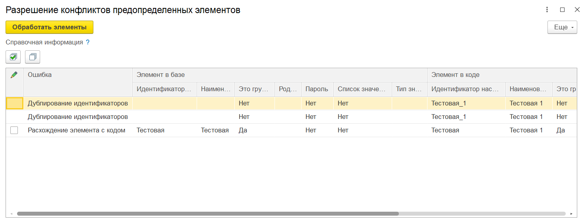

# Подсистема "предопределенные значения"

## Описание подсистемы

По стандартам разработки поиск ссылочных объектов в программном коде по наименованию, коду, гуиду и т.д. не рекомендуется. Для возможности получения ссылок из программного кода предлагается использовать элементы плана видов характеристик. Чтобы избежать необходимости реструктуризации при добавлении новых элементов в ПВХ, формирование иерархии и элементов делается программно и обновляется в пользовательском режиме. Получение элементов стандартизируется через общий модуль с возможностью кэширования.
При коментировании или удалении из кода предопределенных элементов и последующем перезаполнении, элемент будет помечен на удаление, включая все его подчиненные элементы.

## Первоначальное заполнение

Для того чтобы автоматизировать процесс первоначального заполнения предопределенных элементов, необходимо модифицировать/добавить в расширение общий модуль **ПодсистемыКонфигурацииПереопределяемый**. 
В процедуре ``ПриДобавленииПодсистем`` прописать вызов процедуры библиотеки ``пбп_ОбновлениеИнформационнойБазыПБП.ПриДобавленииПодсистем``. Затем выполнить первый запуск - будет выполнен обработчик первоначального заполнения предопределенных элементов.

```BSL
&После("ПриДобавленииПодсистем")
Процедура пбп_ПриДобавленииПодсистем(МодулиПодсистем)
    
    пбп_ОбновлениеИнформационнойБазыПБП.ПриДобавленииПодсистем(МодулиПодсистем);
    
КонецПроцедуры
```

## Уникальность предопределенных элементов

Для обеспечения целостности данных и управления предопределёнными значениями реализован механизм контроля изменений. Он основан на вычислении хеша с использованием алгоритма **MD5**, учёте пометки на удаление, ручных изменений и проверке уникальности идентификаторов.

### Основные этапы проверки
1. **Первоначальная проверка уникальности идентификаторов:**
    - На этапе инициализации идентификаторы всех элементов проверяются на уникальность.
    - Если обнаружены коллизии (дублирующиеся идентификаторы), будет выдано сообщение об ошибке, и такие элементы будут пропущены.
2. **Хеш и состояние элемента:**
    - Хеш вычисляется для каждого элемента и сохраняется в регистре **состояний предопределённых элементов**.
      - **Ключи хеша:**
        - ИдентификаторНастройки
        - Наименование
        - Родитель (если включена иерархия)
        - ЭтоГруппа (если включена иерархия групп и элементов)
        - Изменяемые реквизиты при расчете не учитываются
        - Остальные ключи опционально, зависят от типа объекта метаданных (см. [область Структуры колонок таблиц](../src/cf/CommonModules/пбп_ПредопределенныеЗначенияПереопределяемый/Ext/Module.bsl#247-343) и [исключаемые поля для расчета хеша](../src/cf/CommonModules/пбп_ПредопределенныеЗначенияПереопределяемый/Ext/Module.bsl#345-381))
    - Если элемент изменяется в пользовательском режиме, устанавливается флаг **ручное изменение:**
      - Такой элемент исключается из проверки хеша при последующих обновлениях.
3. **Обработка элементов с пометкой на удаление:**
    - Если элемент помечен на удаление и его хеш отличается от нового:
      - Значения элемента обновляются данными из кода.
      - Пометка на удаление снимается автоматически.
    - Если элемент не помечен на удаление и его хеш отличается от нового:
      - Формируется уведомление о конфликте для дальнейшего разрешения.

**Пример решения конфликтов при создании/обновлении предопределенных элементов**



Виды ошибок:
- Коллизии идентификаторов
  - Эта ошибка не решается в пользовательском режиме, для ее устранения необходимо перейти в общий модуль ``пбп_ПредопределенныеЗначенияПереопределяемый`` и исправить конфликтующие элементы.
- Расхождение элемента с кодом
  - Для элемента установлен флаг обновления: Элемент будет обновлен данными из программного кода, а также обновится хеш элемента в регистре сведений **``пбп_СостоянияПредопределенныхЭлементов``**.
  - Для элемента не установлен флаг обновления: Элемент не будет обновлен. В записи регистра сведений **``пбп_СостоянияПредопределенныхЭлементов``** будет установлен флаг **``Ручное изменение``**, указывающий на то, что элемент был изменен вручную и не подлежит автоматическому обновлению в будущем.
  
  **Примечание** - Флаг ``Заменить элементом из кода`` активен только для элементов с видом ошибки ``Расхождение элемента с кодом``

## Автоматическое создание новых элементов

Для автоматизации процесса заполнения предопределенных элементов необходимо модифицировать/добавить в расширение общий модуль **``ОбщегоНазначенияПереопределяемый``**. В процедуре **``ПриДобавленииСерверныхОповещений``** требуется добавить новое серверное оповещение.

**Пример кода для подключения через расширение**

```BSL
&После("ПриДобавленииСерверныхОповещений")
Процедура пбп_ПриДобавленииСерверныхОповещений(Оповещения)

    // Создаем новое серверное оповещение для предопределённых значений
    Оповещение = СерверныеОповещения.НовоеСерверноеОповещение("пбп_ПредопределенныеЗначения");
	
    // Указываем модуль для получения и отправки сообщений
    Оповещение.ИмяМодуляОтправки  = ""; // В данном случае используется рег. задание для отправки
    Оповещение.ИмяМодуляПолучения = "пбп_ПредопределенныеЗначенияСлужебныйКлиент";
    
    // Настраиваем периодичность проверки (в секундах)
    Оповещение.ПериодПроверки = 300;
	
    // Добавляем новое оповещение в список оповещений
    Оповещения.Вставить(Оповещение.Имя, Оповещение);

КонецПроцедуры
```

## Добавление новых элементов

В модуле **пбп_ПредопределенныеЗначенияПереопределяемый** значения добавляются через метод **Добавить()** коллекции **Результат**, которая представляет собой таблицу предопределённых значений. Каждая новая запись в этой таблице может быть настроена как группа путём установки свойства ЭтоГруппа в значение Истина.  
- **ИдентификаторНастройки**: Уникальный идентификатор группы, который используется для внутренних ссылок и связей между группами.  
- **Родитель**: Идентификатор настройки родительской группы, указывается для элементов и групп являющихся подгруппами.  
- **УровеньИерархии**: Целочисленное значение, определяющее уровень группы в иерархической структуре. Этот параметр используется для обеспечения правильного порядка создания групп, где сначала должны быть созданы группы верхнего уровня, а затем вложенные.

Пример добавления нового элемента в модуле пбп_ПредопределенныеЗначенияПереопределяемый:

```BSL
Функция ПредопределенныеЗначения() Экспорт

	Результат = ТаблицаПредопределенных();

	// Добавление
	НоваяНастройка = Результат.Добавить();
	НоваяНастройка.Наименование = "Пароль доступа на ИТС";
	НоваяНастройка.ИдентификаторНастройки = "ПарольДоступаНаИТС";
	НоваяНастройка.Пароль = Истина;
	НоваяНастройка.СписокЗначений = Ложь;
	НоваяНастройка.ТипЗначения = Новый ОписаниеТипов("Строка",,,, Новый КвалификаторыСтроки(150));
	НоваяНастройка.Родитель = "Доступ_ИТС"; // Указывается идентификатор настройки группы
	// КонецДобавления
	
	Возврат Результат;
	
КонецФункции
```

Пример добавления новой группы в модуле пбп_ПредопределенныеЗначенияПереопределяемый:

```BSL
Функция ПредопределенныеЗначения() Экспорт

	Результат = ТаблицаПредопределенных();

	// Добавление
	НоваяНастройка = Результат.Добавить();
	НоваяНастройка.Наименование = "Интеграции";
	НоваяНастройка.ИдентификаторНастройки = "Интеграции";
	НоваяНастройка.ЭтоГруппа = Истина;
	НоваяНастройка.УровеньИерархии = 0;
	
	НоваяНастройка = Результат.Добавить();
	НоваяНастройка.Наименование = "Интеграции локал";
	НоваяНастройка.ИдентификаторНастройки = "Интеграции_локал";
	НоваяНастройка.ЭтоГруппа = Истина;
	НоваяНастройка.Родитель = "Интеграции";
	НоваяНастройка.УровеньИерархии = 1;
	// КонецДобавления
	
	Возврат Результат;
	
КонецФункции
```

## Получение значения элементов

Для удобной работы с ПВХ у нас есть следующие функции:
 - **пбп_ОбщегоНазначенияСервер.ПолучитьПредопределенноеЗначение(Имя, ИспользоватьКэш)** - если это единичное значение, возвращается сразу оно, если установлен флаг "Список значений" то возвращает массив значений. Для получения часто используемых предопределенных значений, установите ИспользоватьКэш = Истина.
   - Параметры:
     - Имя - Строка
     - ИспользоватьКэш - Булево
   - Возвращаемое значение:
     - ПроизвольныйТип - Значение переменной ПВХ.
     - Массив - Массив значений переменной ПВХ.
 - **пбп_ОбщегоНазначенияСервер.ПолучитьПредопределенныеЗначения(Имена, ВРазрезеКлючей, ИспользоватьКэш)** - если "ВРазрезеКлючей" то возвращает соответствие нескольких элементов ПВХ, если ВРазрезеКлючей = ложь, то возвращает массив значений. Для получения часто используемых предопределенных значений, установите ИспользоватьКэш = Истина.
   - Параметры:
     - Имена - Строка - Имена переменных ПВХ, перечисленные через запятую.
     - ВРазрезеКлючей - Булево
     - ИспользоватьКэш - Булево
   - Возвращаемое значение:
     - Соответствие - Соответствие имен и значений переменных ПВХ.
       - Ключ - Строка - имя значения
       - Значение - ПроизвольныйТип
     - Массив - ПроизвольныйТип

Пример получения множественного результата:

```BSL
Функция ПолучитьДанныеАвторизации()

    ДанныеАвторизации = Новый Структура("Логин, Пароль");
    Результат = пбп_ОбщегоНазначенияСервер.ПолучитьПредопределенныеЗначения("Логин_ИТС, Пароль_ИТС", Истина, Истина);
    
    Для Каждого Пара Из Результат Цикл
        Сообщить("Ключ: " Пара.Ключ);
        Сообщить("Значение: "+ Пара.Значение);
        ДанныеАвторизации[Пара.Ключ] = Пара.Значение;
    КонецЦикла;

    Возврат ДанныеАвторизации;

КонецФункции
```

Пример получения единичного результата:

```BSL
Функция ЗаписыватьДанныеСтандартнымСпособом(ПроверяемаяДата)

    Результат = пбп_ОбщегоНазначенияСервер.ПолучитьПредопределенноеЗначение("ДатаНачалаЗаписиВРегистры", Истина);

    Возврат ПроверяемаяДата = Результат;

КонецФункции
```

