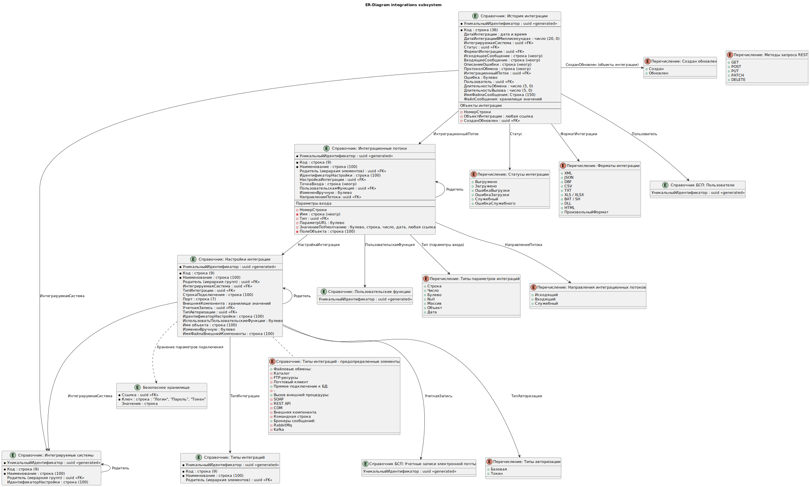
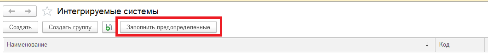
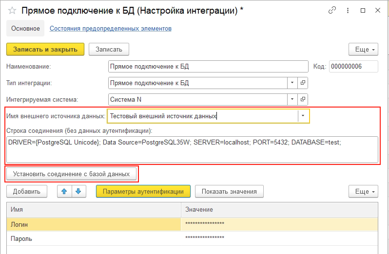
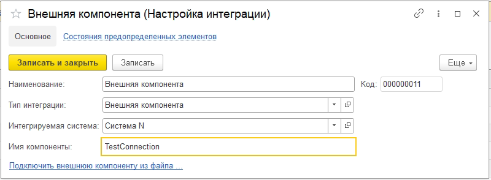
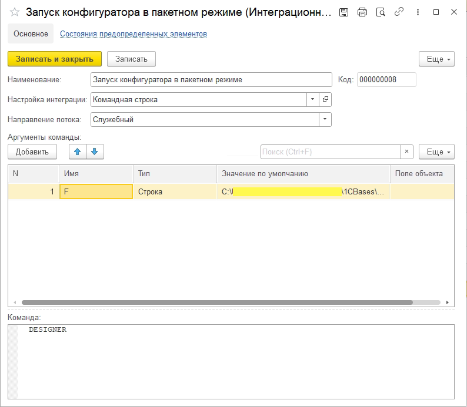
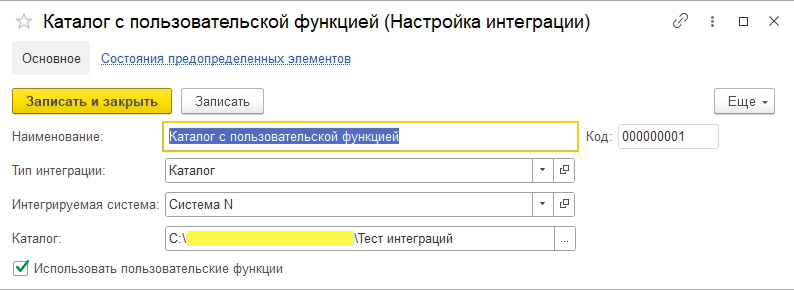
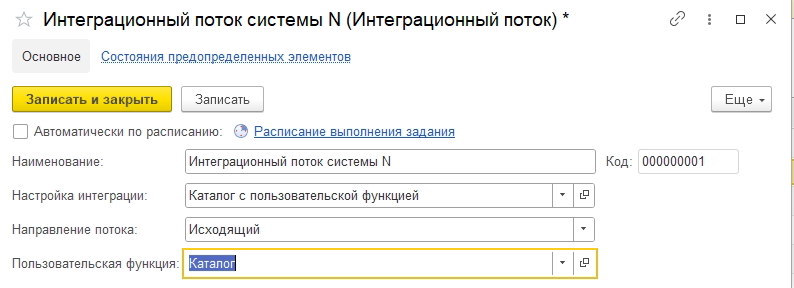
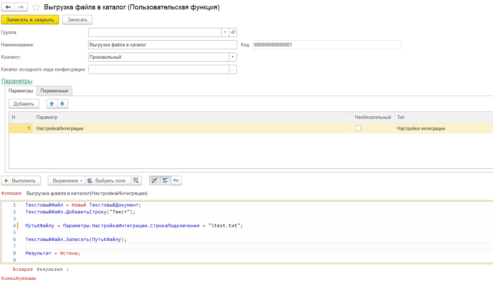

# Подсистема "Управление интеграциями"

## Общие сведения

Подсистема предназначена для хранения и управления настройками интеграций разных типов:
- **Файловые обмены**;
- **Прямое подключение к базе данных**;
- **Вызов внешней процедуры**;
- **Брокеры сообщений**.

Содержит в себе функции для взаимодействия с указанными типами интеграций. Содержит в себе функции для логирования вызовов интеграций.

## Состав подсистемы



1. Справочники
    - **пбп_ИнтегрируемыеСистемы** - верхнеуровневый справочник, хранящий в себе наименования интегрируемых систем;
    - **пбп_ТипыИнтеграций** - содержит в себе перечень предопределенных"*" типов интеграций, под которые выполняются настройки. Необходим для определения варианта настроек,
    состава показываемых полей, определения функций взаимодействия с конечной системой;
    - **пбп_НастройкиИнтеграции** - справочник, предназначенный для хранения настроек подключения и аутентификации в системе. Форма настроек параметризируется в зависимости от выбранного типа интеграции;
    - **пбп_ИнтеграционныеПотоки** - хранит в себе данные о точке входа в интегрируемую систему (ресурс REST, интерфейс SOAP, команду BASH / CMD и пр.), а также передаваемые параметры и аргументы. При внедрении с подсистемой пользовательских функций присутствует возможность настроить регламентное задание ("пбп_ВыполнениеПользовательскихФункцийФайловыхОбменов") для отправки / получения данных, используя пользовательские функции;
    - **пбп_ИсторияИнтеграции** - для логирования вызовов интеграционных потоков. Содержит информацию о входящем / исходящем запросе, задействованных в процессе вызова объектов, протокол вызова, метрики длительности обмена и вызова и т.д.. Для периодической очистки истории интеграций существует регламентное задание "пбп_ОчисткаИсторииИнтеграции";

2. Определяемые типы
    - **пбп_Пользователи** - ссылка на справочник пользователей (БСП). При внедрении в конфигурацию с БСП, необходимо добавить в состав "СправочникСсылка.Пользователи";
    - **пбп_УчетныеЗаписиЭлектроннойПочты** - ссылка на справочник учетных записей электронной почты (БСП). При внедрении в конфигурацию с БСП, необходимо добавить в состав "СправочникСсылка.УчетныеЗаписиЭлектроннойПочты";

3. Регламентные задания
    - **пбп_ОчисткаИсторииИнтеграции** - периодическая очистка справочника "пбп_ИсторияИнтеграции". Для успешных вызовов и вызовов с ошибкой можно настроить разное количество дней хранения логов. Для этого необходимо выставить разное количество дней у элементов "Количество дней хранения истории интеграции" и "Количество дней хранения ошибок истории интеграции" в плане видов характеристик "пбп_ПредопределенныеЗначения" соответственно.
    - **пбп_ВыполнениеПользовательскихФункцийФайловыхОбменов** - ***доступно только при наличии подсистемы пользовательских функций!*** Настройка расписания выполнения пользовательских функций в разрезе интеграционного потока для формирования сообщения получения / отправки файловых интеграций (с локальной / сетевой папкой, ftp / sftp и т.д.). Логика формирования сообщения должна быть заполнена в справочнике "пбп_Пользовательские функции" (см. [Пользовательские функции](ПользовательскиеФункции.md));

4. Общие макеты
    - **пбп_JSONEditor** - содержит web-приложение для вставки в html поле для форматирования в JSON-формат в виде дерева или структуры;
    - **пбп_XMLEditor** - содержит web-приложение для вставки в html поле для форматирования в XML-формат в виде дерева;
    - **пбп_PinkRabbitMQ** - содержит архив с компонентой подключения и взаимодействия с брокером сообщений Rabbit Mq (см. [PinkRabbitMQ library](https://github.com/BITERP/PinkRabbitMQ));
    - **пбп_SimpleKafkaAdapter** - содержит архив с компонентой подключения и взаимодействия с брокером сообщений Kafka (см. [Simple Kafka Connector 1C](https://github.com/NuclearAPK/Simple-Kafka_Adapter));

5. Общие модули
    - **пбп_ИнтеграцииСервер** - модуль программного интерфейса, где описана серверная логика и функции взаимодействия с другими системами (подробно см. в главе [Реализованные методы](#реализованные-методы));
	- **пбп_ИнтеграцииСлужебный** - модуль служебного программного интефейса, где описана логика взаимодействия с объектами подсистемы, а также вспомогательные экспортные функции (подробно см. в главе [Служебный программный интерфейс](#служебный-программный-интерфейс));
	- **пбп_ИнтеграцииFTPSFTP** - модуль программного интерфейса, где описана серверная логика и функции взаимодействия с FTP и SFTP серверами (подробно см. в главе [Реализованные методы](#реализованные-методы));
    - **пбп_КоннекторHTTP** - модуль программного интерфейса, предоставляющий удобную обертку вызовов REST-методов HTTP-сервисов (см. [Коннектор: удобный HTTP-клиент](https://github.com/vbondarevsky/Connector));
	- ***пбп_МетодыРегламентныхЗаданийСервер** - модуль программного интерфейса, являющийся "единым хранилищем" экспортных методов регламентных заданий;
     
"*" В рамках общего отказа от предопределенных значений в справочниках ПБП необходимо уточнение: предопределенные значения справочника **пбп_ТипыИнтеграций** используются по причине того, что в них перечислены общие, стандартизированные и широкоиспользумые типы, которые, в свою очередь, влиют на параметризацию справочников **пбп_НастройкиИнтеграции**, **пбп_ИнтеграционныеПотоки** и **пбп_ИсторияИнтеграции**.

## Ролевая модель

Для создания и настройки объектов подсистемы управление интеграциями существует роль **пбп_РедактированиеНастроекИнтеграции**.

Для просмотра справочника истории интеграции существует роль **пбп_ПросмотрИсторииИнтеграции**.

## Связанные подсистемы

1. [Предопределенные значения](docs/ПредопределенныеЗначения.md)
2. [Переопределения методов БСП](docs/ПереопределениеМетодовБСП.md)
3. [Пользовательские функции](docs/ПользовательскиеФункции.md)
4. [Загрузка файла через табличный документ](docs/ЗагрузкаФайлаЧерезТабличныйДокумент.md)

## Порядок взаимодействия

Взаимодействие с подсистемой будет отличаться для разных типов интеграции, но можно выделить общие шаги для любого типа:
1. После определения типа интеграции, необходимо заполнить информацию о настройках в справочниках подсистемы. Для создания настроек интеграции необходимо создать предопределенные элементы справочников **пбп_ИнтегрируемыеСистемы**, **пбп_НастройкиИнтеграции**, **пбп_ИнтеграционныеПотоки** с помощью подсистемы предопределенных значений (см. [Предопределенные значения](docs/ПредопределенныеЗначения.md)). Создание не предопределенных потоков <ins>допускается только в случае файловых обменов при использовании пользовательских функций</ins> (см. [Использование пользовательских функций](#использование-пользовательских-функций-для-файловых-обменов));
2. Если это "предопределенная" интеграция (без использования пользовательской функции), то вызов должен быть обернут в запись в справочник истории интеграции для хранения в нем логов;
3. Подбор и реализация вызова нужного метода интеграции в зависимости от ее типа;
4. Пост-обработка полученного в п.3 результата вызова;
5. Запись лога обмена в справочник истории интеграции;

### Заполнение предопределенных значений настроек

Для заполнения предопределенных значений необходимо перейти в общий модуль "пбп_ПредопределенныеЗначенияПереопределяемый". В соответствующих объектам метаданных процедурах добавить строки в таблицу предопределенных по обязательным полям:
```bsl
Процедура ПредопределенныеЗначенияИнтегрируемыеСистемы(Таблица) Экспорт

    // Добавление
    НоваяСистема = Таблица.Добавить();
    НоваяСистема.Наименование           = "Система N";
    НоваяСистема.ИдентификаторНастройки = "СистемаN";
    // КонецДобавления

КонецПроцедуры

Процедура ПредопределенныеЗначенияНастройкиИнтеграции(Таблица) Экспорт
    
    // Добавление
    НоваяНастройка = Таблица.Добавить();
    НоваяНастройка.Наименование           = "Интеграция с системой N";
    НоваяНастройка.ИдентификаторНастройки = "ИнтеграцияССистемойN";
    // Параметром передается идентификатор настройки интегрируемой системы
    НоваяНастройка.ИнтегрируемаяСистема   = пбп_ИнтеграцииСлужебный.ИнтегрируемаяСистема("СистемаN");
    // Заполняем необходимый тип интеграции из предопределенных значений справочника, например "SFTP"
    НоваяНастройка.ТипИнтеграции          = Справочники.пбп_ТипыИнтеграций.SFTP;
    // Указываем тип авторизации. Для большинства типов интеграций - это базовая.
    // Для интеграций с типом "брокеры сообщений", "REST API" и "SOAP" доступна авторизация через bearer-токен (JWT-токен)
    НоваяНастройка.ТипАвторизации         = Перечисления.пбп_ТипыАвторизации.Базовая;
    // КонецДобавления

КонецПроцедуры

Процедура ПредопределенныеЗначенияИнтеграционныеПотоки(Таблица) Экспорт

    // Добавление
    НовыйМетод = Таблица.Добавить();
    НовыйМетод.Наименование           = "Интеграционный поток системы N";
    НовыйМетод.ИдентификаторНастройки = "ИнтеграционныйПотокСистемыN";
    // Направление потока служит логическим разделением потоков по отношению к системе-корреспонденту:
    // Исходящий - ИС-отправитель - наша система, ИС-получатель - сторонняя;
    // Входящий - ИС-отправитель - сторонняя система, ИС-получатель - наша;
    // Служебный - для служебных методов, по типу отправки оповещений / логов / очистки файлов и т.д.
    НовыйМетод.НаправлениеПотока      = Перечисления.пбп_НаправленияИнтеграционныхПотоков.Исходящий;
    // КонецДобавления

КонецПроцедуры
```
Идентификатор настройки каждого объекта должен быть уникальным в рамках одного типа метаданных.
После инициализации и заполнения предопределенных элементов в коде, необходимо зайти в пользовательский режим в формы списков соответствующих справочников и нажать на кнопку "Заполнить предопределенные" в следующей последовательности: интегрируемые системы, настройки интеграции, интеграционные потоки:



### Служебный программный интерфейс

Как видно из прошлого примера (заполнения предопределенных значений настройки интеграции), для поиска интегрируемой системы по идентификатору настройки вызывается метод общего модуля пбп_ИнтеграцииСлужебный. Помимо данной функции в этом модуле служебного программного интерфейса реализована следующая логика и методы:

1. **Работа с историей интеграции**:
* ПолучитьСтруктуруЗаписиИстории - возвращает структуру со всеми необходимыми значениями для заполнения записи истории интеграции;
* СоздатьСообщениеИсторииИнтеграции - создает запись справочника История интеграции с информацией о событии интеграции (лог). В первом параматре передается заполненная структура, полученная из функции ПолучитьСтруктуруЗаписиИстории;
* ДобавитьЗаписьВПротоколОбмена - дополняет значение ключа "ПротоколОбмена" структуры строкой события через разделитель, полученной из функции ПолучитьСтруктуруЗаписиИстории. В первом параметре передается структура записи истории, во втором - текст добавляемого сообщения, в третьем - разделитель (по-умолчанию: '";" + Символы.ПС');
* ПолучитьПредставлениеТекстЗапросаВнешнегоИсточникаДанных - возвращает представление текста запроса для внешнего источника данных. Вместо имен параметров запроса в его тексте подставляются значения параметров. Первым параметром передается запрос, который необходимо конвертировать в строку;
2. **Работа с данными подсистемы**:
* ПолучитьСтруктуруНастроекИнтеграции - возвращает структуру со значениями реквизитов настроек интеграции, включая данные безопасного хранилища (логин, пароль / токен). В параметре указывается ссылка на настройку интеграции;
* ПолучитьСтруктуруПотокаИНастроекИнтеграции - аналогично предыдущей функции, но получает данные по интеграционному потоку, добавляя в структуру данные по точке входа. В параметр передается ссылка на интеграционный поток;
* ПолучитьСтруктуруПараметровВхода - возвращает структуру, полученную из реквизитов табличной части "ПараметрыВхода" интеграционного потока. Вторым параметром указывается заполнять значения по умолчанию для параметров или нет. В случае, если параметры заполняются по умолчанию, то каждой строке параметра будет выведено значение, заполненное в табличной части, конвертированное в JSON-формат (булево: "true" или "false"; дата: "yyyy-MM-dd" и т.д.). В противном случае, значение будет конвертировано в тип 1С, указанный в колонке "Тип" табличной части;
* ИнтеграционныйПоток - возвращает интеграционный поток по идентификатору настройки;
* ИнтегрируемаяСистема - возвращает интегрируемую систему по идентификатору настройки;
* НастройкаИнтеграции - возвращает настройку интеграции по идентификатору настройки;

### Заполнение истории интеграции

Познакомившись со служебным программным интерфейсом подсистемы, можно приступить к инициализации и заполнению логов интеграции. Подразумевается, что каждый вызов в рамках обмена должен быть зафиксирован в истории интеграции. Исключением из данного правила могут являться только потоки с направлением "служебный". Информация этих потоков должна записываться в историю интеграции на усмотрение разработчика.
Для создания записи логов в методе, котором будем реализовывать вызов функций обмена, иницилизируем структуру записи истории интеграции и заполним ее информацией о вызове:
```bsl
Процедура ВыполнитьВыгрузкуИнтеграционныйПотокСистемыN() Экспорт

    // Получаем интеграционный поток, по которому будет происходить вызов 
    ИнтеграционныйПоток = пбп_ИнтеграцииСлужебный.ИнтеграционныйПоток("ИнтеграционныйПотокСистемыN");
    РеквизитыПотока = пбп_ОбщегоНазначенияСервер.ЗначенияРеквизитовОбъекта(
        ИнтеграционныйПоток, "НастройкаИнтеграции.ИнтегрируемаяСистема, ТочкаВхода"
    );

    // Инициализируем структуру записии истории интеграции
    СтруктураИстории = пбп_ИнтеграцииСлужебный.ПолучитьСтруктуруЗаписиИстории();
    СтруктураИстории.ИнтеграционныйПоток  = ИнтеграционныйПоток;
    СтруктураИстории.ИнтегрируемаяСистема = РеквизитыПотока.НастройкаИнтеграцииИнтегрируемаяСистема;
    СтруктураИстории.ФорматИнтеграции     = Перечисления.пбп_ФорматыИнтеграции.TXT;

    // Оборачиваем вызов метода интеграции в try-catch для записи исключения в логи
    Попытка
        ЗаголовокОшибки = "Не удалось сохранить файл на SFTP-сервере"

        // Вызов метода интеграции.
        // ...
        // Пост-обработка ответа
        // ...
    Исключение
	    // Функция возвращает конкатенированную строку из заголовка ошибки и подробного представления информации об ошибки из обработки ошибок
        СообщениеОбОшибке = пбп_ИнтеграцииСервер.ПолучитьПодробноеПредставлениеОшибкиИсключения(
            ЗаголовокОшибки, ИнформацияОбОшибке());
        // Сохраняем описание ошибки в структуре истории
        СтруктураИстории.ОписаниеОшибки = СообщениеОбОшибке;
    КонецПопытки;

    // Записываем полученную структуру в объект справочника история интеграции
    пбп_ИнтеграцииСлужебный.СоздатьСообщениеИсторииИнтеграции(СтруктураИстории);

КонецПроцедуры
```

Рассмотрим подробно каждый ключ структуры записи истории, и, соответственно, реквизитный состав справочника истории интеграции:
1) ИнтеграционныйПоток - ссылка на справочник интеграционные потоки, по которому происходит вызов;
2) ВходящееСообщение - строка. Строковое представление входящих данных (ответ ИС-корреспондента или запрос к нашей системе, если инициатором выступает сторонняя система). Например, содержимое текстового файла, содержимое файла JSON, содержимое файла XML и так далее. Вид отображения сообщения регулируется типом формата интеграции. Для форматов интеграции XML и JSON реализованы html-поля для отображения текста в виде дерева или структуры;
3) ИсходящееСообщение - строка. Аналогично п.2;
4) ИнтегрируемаяСистема - ссылка на справочник интегрируемые системы. ИС, с которой происходит обмен;
5) ОписаниеОшибки - строка. Подробное описание ошибки обмена, в следствии которой он был прерван;
6) ПротоколОбмена - строка. Подробный строковый лог, в который необходимо сохранять данные об создаваемых / изменяемых объектах с однозначной идентификацией, данные о предупреждениях и ошибках, которые не прерывают обмен и т.д.. Например:
```bsl
// В таблице значений ПолученнаяНоменклатура находятся данные о номенклатуре
Для Каждого СтрокаНоменклатуры Из ПолученнаяНоменклатура Цикл
    Если ЗначениеЗаполнено(СтрокаНоменклатуры.Ссылка) Тогда
        НоменклатураОбъект = СтрокаНоменклатуры.Ссылка.ПолучитьОбъект();

        Попытка
            НоменклатураОбъект.Заблокировать();
		Исключение
            // Добавляем запись в протокол об ошибке блокировки
            ТекстСообщения = СтрШаблон("ru = 'Номенклатура %1 не была обновлена по причине: не удалось заблокировать объект';",
                СтрокаНоменклатуры.НаименованиеНоменклатуры);
            пбп_ИнтеграцииСлужебный.ДобавитьЗаписьВПротоколОбмена(СтруктураИстории, ТекстСообщения);

            Продолжить;
        КонецПопытки;
    Иначе
        НоменклатураОбъект = Справочники.Номенклатура.СоздатьОбъект();
    КонецЕсли;
    
    // Заполнение объекта

    Попытка
        НоменклатураОбъект.Записать();
    Исключение
        // Добавляем запись в протокол об ошибке записи номенклатуры
        ТекстСообщения = СтрШаблон("ru = 'Номенклатура %1 не была записана по причине: %2';",
            СтрокаНоменклатуры.НаименованиеНоменклатуры, ОбработкаОшибок.ПодробноеПредставлениеОшибки(ИнформацияОбОшибке()));
        пбп_ИнтеграцииСлужебный.ДобавитьЗаписьВПротоколОбмена(СтруктураИстории, ТекстСообщения);
    КонецПопытки;
КонецЦикла;
```
7) ДатаНачалаИнтеграции - текущая дата сеанса, время начала выполнения интеграционного потока;
8) ДлительностьВызова - время ответа системы-корреспондента. Перед вызовом необходимо зафиксировать время начала, после вызова заполнить длительность вызова как ТекущаяДатаСенса() - <время начала>, например:
```bsl
// Инициализируем время начала
НачалоВызова = ТекущаяДатаСеанса();
// Производим вызов
Ответ = КоннекторHTTP.Get(<URL>, <Параметры запроса>);
// Фиксируем время вызова
СтруктураИстории.ДлительностьВызова = ТекущаяДатаСеанса() - НачалоВызова;
```
9) ФорматИнтеграции - перечисление, значение которого отражает содержимое текстов сообщений. Для обмена текстовыми файлами - TXT, для REST API - JSON, для SOAP - XML и т.д. Исключением является формат BATSH. При заполнении его в исходящем запросе заполняется команда/скрипт, который передается командной оболочке на исполнение, во входящем запросе - результат вызова команды. Если результатом вызова является перенаправление результата выполнения команды в файл (>, >>), то должно быть указано его содержимое в ключе ВходящееСообщение или заполнены ключи "ИмяФайлаСообщения" и "ФайлСообщения": в этом случае вместо поля со строкой на закладке входящее сообщение будет выведена гиперссылка с файлом, по нажатию которой файл можно сохранить в каталог;
10) ИмяФайлаСообщения - строка с именем файла, если в процессе интеграции передается файл, который нельзя конвертировать в строковое представление (например, файл Excel);
11) ФайлСообщения - файл в хранилище значения. Данные файла интеграции (например, файл Excel);
12) ОбрабатыватьСообщение - булево. Если Истина, то перед записью истории интеграции из исходящего и входящего сообщения будут очищены значения атрибутов (полей), длина которых превышает 1000 символов.

### Реализованные методы

Переходим к методам программного интерфейса, которые выполняют вызов к системе-корреспонденту

1. **Файловые обмены (через локальный и сетевой каталог)**:
* *Расширенный функционал программного интерфейса не предусмотрен*
2. **Файловые обмены через FTP / SFTP (реализовано в отдельном модуле "пбп_ИнтеграцииFTPSFTP")**:
* ПараметрыСообщенияFTPSFTP - возвращает инициализированную структуру параметров сообщения обмена. Ключи:
	- Путь - локальный полный путь файла сообщения;
	- ИмяФайла - имя файла сообщения без расширения;
	- Расширение - расширение файла сообщения обмена;
	- РасширениеНаСервере - расширение файла сообщения обмена на сервере, если оно отличается от того расширения, которое необходимо передать / сохранить. Например, если на сервере csv-файл лежит без расширения, а его нужно получить с расширением "csv", то в ключе "Расширение" указывается "csv", а РасширениеНаСервере = "". Если расширения не отличаются, то РасширениеНаСервере должно быть равно Неопределено;
	- ДвоичныеДанные - двоичные данные файла обмена. Если они указаны, а ключ "Путь" не заполнен, то при обмене путь будет заполнен адресом временного файла, по которому сохраняются двоичные данные файла; 
* ПолучитьПараметрыПодключенияFTPSFTP - возвращает структуру настроек подключения к серверу из настроек интеграции (аналогично, ПолучитьСтруктуруНастроекИнтеграции, но с добавлением каталога входящего и каталога исходящего);
* ВыполнитьПодключениеКFTPСерверуДляИнтеграционногоПотока - устанавливает и возвращает FTPСоединение по интеграционному потоку. Если указан каталог исходящий, то он будет установлен соединению, как текущий каталог;
* ОтправитьСообщениеFTP - отправляет файл сообщения на FTP-сервер. Функции необходимо передать FTPСоединение, полученное в результате вызова функции "ВыполнитьПодключениеКFTPСерверуДляИнтеграционногоПотока" и параметры сообщения, полученные в результате заполнения структуры из функции ПараметрыСообщенияFTPSFTP. В случае ошибки возвращает строку с описание ошибки;
* ПрочитатьСообщениеFTP - аналогично ОтправитьСообщениеFTP, но получает файл на FTP-сервере. Прочитанный файл будет находится во временном каталоге, адрес которого будет указан в ключе "Путь";
* ПроверитьФайлЕстьНаFTP - проверяет наличие файла в указанном каталоге на FTP-сервере. Возвращает Истина, если файл найден, в противном случае Ложь. Функции необходимо передать FTPСоединение, имя файла, каталог, в котором будет происходить поиск файла. Возможен поиск по точному совпадению и по началу строки. Для этого необходимо заполнить четвертый параметр "ПоТочномуСовпадению" (по-умолчанию, Истина);

Далее идут методы взаимодействия с SFTP-сервером. Так как в платформе нет встроенных функций общения с SFTP-серверами, обмен с ними был реализован с помощью утилит системы, взаимодействие с которыми выполняется посредством выполнения скриптов командной оболочки.
Для взаимодействия с SFTP на ОС Linux используется одна из установленных утилит:

	1) curl - служебная программа командной строки, позволяющая взаимодействовать с множеством различных серверов по множеству различных протоколов с синтаксисом URL;
	2) sshpass - утилита командной строки для автоматической передачи пароля SSH при подключении к удаленному хосту через SSH;
	3) expect - инструмент для автоматизации и тестирования в ОС 'nix. Скрипт может запустить командный интерпретатор, прочитать переменные окружения, выполнить набор команд Unix для получения информации, и после этого ввести в интерфейс командной строки необходимую информацию.

Сначала происходит проверка того, какая из утилит установлена (в указанной последовательности).
Если одна из утилит найдена, то через нее выполняется bash-скрипт для установки соединения с SFTP-сервером.

Для отправки на ОС Windows будет использоваться WinSCP (*Находится в стадии разработки*).

Если указанные выше утилиты не найдены, то их следует установить. В противном случае, будет получена ошибка.

* ОтправитьСообщениеSFTP - аналогично ОтправитьСообщениеFTP, но добавлен третий параметр на вход: СтруктураИстории;
* ПолучитьСодержимоеКаталогаSFTP - возвращает таблицу значений с колонками ИмяФайла и ДатаИзменения с соответствующими данными. Функции необходимо передать ссылку на интеграционный поток, каталог, содержимое которого нужно прочитать и структуру истории;
* ПроверитьФайлЕстьНаSFTP - аналогично ПроверитьФайлЕстьНаFTP, но добавлен третий параметр на вход: СтруктураИстории;
* ПрочитатьСообщениеSFTP - аналогично ПрочитатьСообщениеFTP, но добавлен третий параметр на вход: СтруктураИстории;
* УдалитьФайлSFTP - удаляет указанный файл с SFTP-сервера. Необходимо передать интеграционный поток, имя файла, который нужно удалить (если он известен, если нет, то необходимо сначала получить список файлов через ПолучитьСодержимоеКаталогаSFTP), каталог, где файл находится и структуру интеграции. В четвертом параметре указывается необходимо ли проверять наличие файла перед удалением. Если Истина, то при нахождении файла удаление будет продолжен, при ошибке поиска - будет возвращена строка с ошибкой. По-умолчанию файл проверяется перед удалением;
3. **Файловые обмены через почту**:
Реализовано через функции БСП. При внедрении подсистемы в конфигурацию с БСП, в определяемом типе "пбп_УчетныеЗаписиЭлектроннойПочты" необходимо указать СправочникСсылка.УчетныеЗаписиЭлектроннойПочты. Пример реализации см.
4. **Прямое подключение к БД**:
* ИнициализироватьТаблицуПараметровЗапросаВнешнегоИсточника - возвращает пустую таблицу параметров запроса внешнего источника
* УстановитьСоединениеСВнешнимИсточникомДанныхПоНастройкеИнтеграции - заполняет настройки подключения к внешнему источнику данных по настройке интеграции. Устанавливает параметры соединения пользователя и сеанса (аналогично управленю внешними источниками данных, но внутри подсистемы управления интеграциями);
* ПолучитьТаблицуДанныхИзВнешнегоИсточникаПоУсловиям - функция-обертка для выполнения простых запросов выборки данных из таблиц внешнего источника. Преимущество ее использования перед выполнением прямого запроса является то, что колонки таблицы значений, полученной в результате выполнения запроса, будут типизированными (данные о типах берутся из соответствующей колонки таблицы внешнего источника). В параметрах указывается интеграционный поток с заполненным именем таблицы внешнего источника (к ней будет обращен запрос), строка имен полей таблицы через запятую, которые необходимо выбрать, таблица параметров запроса с колонками:
- НаименованиеПоля - строка - наименование поля таблицы, по которому необходимо наложить условие;
- Оператор - строка - оператор сравнения поля таблицы и значения параметра ("=", ">" и т.д.);
- Значение - любой базовый тип - параметр запроса, с которым сравнивается значение поля таблицы,
а также количество первых записей: если не равно 0, то будет выбрано указанное количество первых строк ("ПЕРВЫЕ <КоличествоПервых>"), и структура истории. Если в переданном интеграционном потоке заполнены параметры входа, то они будут добавлены в запрос как отдельные предопределенные условия;
* ИнициализироватьТаблицуЗначенийИзТаблицыВнешнегоИсточника - возвращает инициализированную таблицу значений из таблицы внешнего источника по метаданным с типизированными колонками. Заполняется по имени внешнего источника, имени таблицы, и строке необходимых полей, заполненных через запятую (если не заполнено, то инициализируются все поля таблицы);
5. **COM**:
* *Расширенный функционал программного интерфейса не предусмотрен*
6. **REST API**:
* ПолучитьЗапросТекстомИзСоответствияJSON - конвертирует тело HTTP-запроса из соответствия в строку. На вход подается Структура или Соответствие с телом JSON;
* ПодготовитьТаблицуКодовОтветаHTTP - возвращает таблицу значений стандартных кодов ответа HTTP;
* РасшифровкаКодаСостоянияHTTP - возвращает строковую расшифровку кода состояния HTTP;
Для выполнения методов REST необходимо использовать методы общего модуля КоннекторHTTP.
7. **SOAP**:
* ОтформатироватьXMLЧерезDOM - форматирует XML запрос в строковом виде для удобного чтения. Если содержимое файла идет одной строкой, то оно будет преобразовано в многострочный файл. В параметрах функции передается исходная строка xml-текста и указатель использования отступов: если истина, то будут сформированы отступы в соответствии с правилами форматирования XML;
8. **Внешняя компонента**:
* *Расширенный функционал программного интерфейса не предусмотрен*
9. **Командная строка**:
* ВыполнитьКомандуСистемы - выполняет указанную команду системы интеграционного потока. Команда выполняется в командной оболочке: либо CMD для ОС Windows, либо терминале BASH для ОС 'nix и MacOS;
10. **Брокеры сообщений**:
* *Раздел будет дополнен позже по мере разработки новых функций*
11. **Прочие функции**:
* ЗашифроватьBase64Сервер - возвращает строку, закодированную в base64. Функции необходимо передать исходную строку и кодировку текста (по-умолчанию, "UTF-8");
* ДатаИзUnixTime - получает дату из UnixTime: ковентирует дату из числа секунд в дату;
* ПолучитьПодробноеПредставлениеОшибкиИсключения - формирует строку по шаблону "<Заголовок ошибки>. Подробно: <Подробное представление ошибки из обработки ошибок>". Заголовок ошибки передается в первом параметры функции, во втором параматре передается ИнформацияОбОшибке;

Рассмотрим заполнение данных на примерах по типам интеграций.

## Примеры вызова

В этой главе находятся примеры вызова функций программного интерфейса для произведения обмена с ИС-корреспондентом по типам интеграций. Подразумевается, что мы уже создали предопределенные элементы и объявили структуру истории интеграции: она будет находится в переменной СтруктураИстории.

### Файловые интеграции

#### Локальный или сетевой каталог

Отдельных методов для выгрузки / загрузки файлов в / из локального или сетевого каталога не реализовано.
Выгрузка в локальный или сетевой каталог ничем не отличается от других типов интеграций. В настройках интеграции необходимо указать каталог выгрузки / загрузки файла и выполнить его чтение и пост-обработку. Результаты и промежуточные логи должны сохраняться в историю интеграции.

#### FTP

Для обмена с FTP введем условность, что вызов обмена будет происходить с сервера, а на серверный метод с клиента передается описание помещенного файла на сервер.

```bsl
&НаКлиенте
Процедура ПослеПомещенияФайлаНаСерверFTP(ОписаниеПомещенногоФайла, Знач ДополнительныеПараметры) Экспорт

	ПомещенныйФайл = ОписаниеПомещенногоФайла.СсылкаНаФайл.Файл;
	
	ОтправитьФайлНаFTP(ОписаниеПомещенногоФайла.Адрес, ПомещенныйФайл.ИмяБезРасширения, ПомещенныйФайл.Расширение);
	
КонецПроцедуры

&НаСервере
Процедура ОтправитьФайлНаFTP(АдресФайла, ИмяБезРасширения, Расширение)

	// Объявление и заполнение структуры истории
	
	// Заполняем параметры сообщения
	ПараметрыСообщения = пбп_ИнтеграцииFTPSFTP.ПараметрыСообщенияFTPSFTP();
	
	ДвоичныеДанныеФайла = ПолучитьИзВременногоХранилища(АдресФайла);
	ИмяФайла = ПолучитьИмяВременногоФайла(Расширение);
	ДвоичныеДанныеФайла.Записать(ИмяФайла);
	
	ПараметрыСообщения.Путь       = ИмяФайла;
	ПараметрыСообщения.ИмяФайла   = ИмяБезРасширения;
	ПараметрыСообщения.Расширение = Расширение;

	ИнтеграционныйПоток = пбп_ИнтеграцииСлужебный.ИнтеграционныйПоток("ПередачаФайлаНаFTPСервер");

	// Выполняем подключение к FTP-серверу
	FTPСоединение = пбп_ИнтеграцииСервер.ВыполнитьПодключениеКFTPСерверуДляИнтеграционногоПотока(ИнтеграционныйПоток);

	СообщениеОбОшибке = пбп_ИнтеграцииСервер.ОтправитьСообщениеFTP(FTPСоединение, ПараметрыСообщения);
	
	// При получении файла с FTP адрес файла будет находится в ПараметрыСообщения.Путь. Перед удалением необходимо выполнить пост-обработку
	пбп_ФайловаяСистемаПереадресация.УдалитьВременныйФайл(ПараметрыСообщения.Путь);

	Если Не ПустаяСтрока(СообщениеОбОшибке) Тогда
		СтруктураИстории.ОписаниеОшибки = СообщениеОбОшибке;
	КонецЕсли;

	пбп_ИнтеграцииСлужебный.СоздатьСообщениеИсторииИнтеграции(СтруктураИстории);

КонецПроцедуры
```

#### SFTP

Для обмена с SFTP подразумевается, что файл есть на SFTP-сервере. Для избежания ошибок пути исходящего и входящего каталогов должны быть со слэшом "/" в начале и конце.

```bsl
Функция ПолучитьФайлОбменаСSFTPСервера(ИнтеграционныйПоток, КаталогПоиска, СтруктураИстории)

	// Объявление и заполнение структуры истории

	ПараметрыСообщения = пбп_ИнтеграцииFTPSFTP.ПараметрыСообщенияFTPSFTP();
	ПараметрыСообщения.ИмяФайла = ИмяФайла;
	Если СтрНайти(ИмяФайла, ".") > 0 Тогда
		ИмяРасширение = СтроковыеФункцииКлиентСервер.РазложитьСтрокуВМассивПодстрок(ИмяФайла, ".");
		ПараметрыСообщения.Расширение = ИмяРасширение[1];
	КонецЕсли;

	// Получаем сообщением с SFTP-сервера
	СообщениеОбОшибке = пбп_ИнтеграцииСервер.ПрочитатьСообщениеSFTP(
		ИнтеграционныйПоток, ПараметрыСообщения, СтруктураИстории);
	// Файл не был получен из-за ошибки
	Если Не ПустаяСтрока(СообщениеОбОшибке) Тогда
		СтруктураИстории.ОписаниеОшибки = СообщениеОбОшибке;
		пбп_ИнтеграцииСлужебный.СоздатьСообщениеИсторииИнтеграции(СтруктураИстории);
		Возврат;
	КонецЕсли;

	// Пост-обработка файла
	ЧтениеФайла = Новый ЧтениеТекста(ПараметрыСообщения.Путь);
	ТекущаяСтрока = ЧтениеФайла.ПрочитатьСтроку();
	Пока ТекущаяСтрока <> Неопределено Цикл
		ТекущаяСтрока = ЧтениеФайла.ПрочитатьСтроку();

		// Записываем строку прочитанного файла в протокол
		пбп_ИнтеграцииСлужебный.ДобавитьЗаписьВПротоколОбмена(СтруктураИстории, ТекущаяСтрока);
	КонецЦикла;
	
	ЧтениеФайла.Закрыть();

	// Удаляем созданный временный файл
	пбп_ФайловаяСистемаПереадресация.УдалитьВременныйФайл(ПараметрыСообщения.Путь);

	пбп_ИнтеграцииСлужебный.СоздатьСообщениеИсторииИнтеграции(СтруктураИстории);

КонецФункции
```

#### Почтовый клиент

Подразумевается, что учетная запись электронной почты уже заполнена, и ссылка на нее указана в настройках интеграции

```bsl
Процедура ОтправитьПисьмоНаПочту()

	// Объявление и заполнение структуры истории

	ИнтеграционныйПоток = пбп_ИнтеграцииСлужебный.ИнтеграционныйПоток("ОтправкаСообщенияНаПочту");
	РеквизитыПотока = пбп_ОбщегоНазначенияСервер.ЗначенияРеквизитовОбъекта(
		ИнтеграционныйПоток, "НастройкаИнтеграции.ИнтегрируемаяСистема, НастройкаИнтеграции.УчетнаяЗапись");

	Попытка
		ПолучателиПисьма = Новый Массив;
		ПолучателиПисьма.Добавить("test@gmail.com");

		ПочтовоеСообщение = Новый ИнтернетПочтовоеСообщение;
		ПочтовоеСообщение.Тема = "Отправка письма на почту";

		ТекстПисьма = НСтр("ru = 'Письмо успешно доставлено на указанную почту!'");
		
		ПочтовоеСообщение.Тексты.Добавить(ТекстПисьма, ТипТекстаПочтовогоСообщения.ПростойТекст);

		Для Каждого СтрокаЗначение Из ПолучателиПисьма Цикл
			ПочтовоеСообщение.Получатели.Добавить(СтрокаЗначение);
		КонецЦикла;

		РезультатОтправки = РаботаСПочтовымиСообщениями.ОтправитьПисьмо(
			РеквизитыПотока.НастройкаИнтеграцииУчетнаяЗапись, ПочтовоеСообщение);
		
		ТекстСообщения = СтрШаблон("Сообщение обмена отправленно от указанной в настройках почты %1",
			РеквизитыПотока.НастройкаИнтеграцииУчетнаяЗапись.АдресЭлектроннойПочты);
		
		пбп_ИнтеграцииСлужебный.ДобавитьЗаписьВПротоколОбмена(СтруктураИстории, ТекстСообщения);
	Исключение
		СообщениеОбОшибке = пбп_ИнтеграцииСервер.ПолучитьПодробноеПредставлениеОшибкиИсключения(
			ЗаголовокОшибки, ИнформацияОбОшибке());
		СтруктураИстории.ОписаниеОшибки = СообщениеОбОшибке;
	КонецПопытки;

	пбп_ИнтеграцииСлужебный.СоздатьСообщениеИсторииИнтеграции(СтруктураИстории);

КонецПроцедуры
```

### Прямое подключение к базе данных

Перед взаимодействием с внешним историчном данных в настройках интеграции необходимо заполнить строку подключения к СУБД по ODBC-драйверу без параметров логина и пароля пользователя, например:

DRIVER={PostgreSQL Unicode}; Data Source=PostgreSQL35W; SERVER=localhost; PORT=5432; DATABASE=test;

и имя внешнего источника в конфигураторе, после чего нажать на кнопку "Установить соединение с базой данных":



В интеграционном потоке в поле "Имя таблицы внешнего источника данных" указываем имя таблицы, к которой будем обращаться.

```bsl
Процедура ПолучитьДанныеИзТестовойТаблицы()

	// Объявление и заполнение структуры истории

	ИнтеграционныйПоток = пбп_ИнтеграцииСлужебный.ИнтеграционныйПоток("ПолучитьДанныеНоменклатурыИзВнешнегоИсточника");

	// В имени объекта находится имя внешнего источника данных
	РеквизитыПотока = пбп_ОбщегоНазначенияСервер.ЗначенияРеквизитовОбъекта(
		ИнтеграционныйПоток, "НастройкаИнтеграции.ИнтегрируемаяСистема, НастройкаИнтеграции.ИмяОбъекта, ТочкаВхода");

	Попытка
		// Заполняем параметры запроса выборки данных из таблицы
		ПараметрыЗапроса = пбп_ИнтеграцииСервер.ИнициализироватьТаблицуПараметровЗапросаВнешнегоИсточника();
		ПараметрЗапроса = ПараметрыЗапроса.Добавить();
		ПараметрЗапроса.НаименованиеПоля = "Наименование";
		ПараметрЗапроса.Оператор         = "=";
		ПараметрЗапроса.Значение         = "Новая номенклатура №1";

		// Заполняем наименования нужных полей. Если второй параметр не заполнен, то таблица будет заполнена всеми колонками
		ПоляЗапроса = "Наименование, Артикул, Цена";

		// В четвертом параметре количество первых строк. Допустим, нужна только первая строка выборки
		ТаблицаРезультат = пбп_ИнтеграцииСервер.ПолучитьТаблицуДанныхИзВнешнегоИсточникаПоУсловиям(
			ИнтеграционныйПоток, ПоляЗапроса, ПараметрыЗапроса, 1, СтруктураИстории);		

		// Теперь по полученным из таблицы данным устанавливаем ссылки на номенклатуру.
		// Полученная таблица с типизированными колонками, поэтому сразу готова к помещению в параметр запроса
		Запрос = Новый Запрос;
		Запрос.УстановитьПараметр("ТЗ", ТаблицаРезультат);
		Запрос.Текст = "ВЫБРАТЬ
		|	ТЗ.Артикул КАК Артикул,
		|	ТЗ.Наименование КАК Наименование,
		|	ТЗ.Цена КАК Цена
		|ПОМЕСТИТЬ ВТ
		|ИЗ
		|	&ТЗ КАК ТЗ
		|;
		|
		|////////////////////////////////////////////////////////////////////////////////
		|ВЫБРАТЬ
		|	ВТ.Наименование КАК Артикул,
		|	ВТ.Наименование КАК Наименование,
		|	ВТ.Цена КАК Цена,
		|	ЕСТЬNULL(Номенклатура.Ссылка, ЗНАЧЕНИЕ(Справочник.Номенклатура.ПустаяСсылка)) КАК Ссылка
		|ИЗ
		|	ВТ КАК ВТ
		|	ЛЕВОЕ СОЕДИНЕНИЕ Справочник.Номенклатура КАК Номенклатура
		|		ПО ВТ.Артикул = Номенклатура.Артикул";

		РезультатЗапроса = Запрос.Выполнить();
		ВыборкаРезультатаЗапроса = РезультатЗапроса.Выбрать();

		Пока ВыборкаРезультатаЗапроса.Следующий() Цикл
			// Пост-обработка
			// Не забываем делать запись в протокол обмена
		КонецЦикла;
	Исключение
		СообщениеОбОшибке = пбп_ИнтеграцииСервер.ПолучитьПодробноеПредставлениеОшибкиИсключения(
			ЗаголовокОшибки, ИнформацияОбОшибке());
		СтруктураИстории.ОписаниеОшибки = СообщениеОбОшибке;
	КонецПопытки;

	пбп_ИнтеграцииСлужебный.СоздатьСообщениеИсторииИнтеграции(СтруктураИстории);

КонецПроцедуры
```
Использование функции "ПолучитьТаблицуДанныхИзВнешнегоИсточникаПоУсловиям" можно игнорировать, если планируется разработка собственного запроса выборки. Единственное отличие будет в том, что после выполнения запроса нужно иинициализировать таблицу значений с типизированными колонками. Для этого можно использовать функцию "ИнициализироватьТаблицуЗначенийИзТаблицыВнешнегоИсточника":
```bsl
// Выполнение запроса
ТипизированнаяТаблица = пбп_ИнтеграцииСервер.ИнициализироватьТаблицуЗначенийИзТаблицыВнешнегоИсточника(
	РеквизитыПотока.НастройкаИнтеграцииИмяОбъекта, РеквизитыПотока.ТочкаВхода);

// Переносим данные в типизированную таблицу значений
Пока ВыборкаРезультатаЗапроса.Следующий() Цикл
	ЗаполнитьЗначенияСвойств(ТипизированнаяТаблица.Добавить(), ВыборкаРезультатаЗапроса);
КонецЦикла;

Запрос = Новый Запрос;
// Далее аналогично предыдущему примеру
// ...
```

### Вызов внешней процедуры

#### COM

Отдельных методов для вызова COM-объектов не реализано, но подсистема сохраняет в себе данные наименования COM-объекта и строку подключения к нему. COM-объекты стоит избегать и использовать в крайних случаях, когда без них не обойтись. Например, для взаимодействия с Active Directory в семействе Windows.
Аналогично другим настройкам интеграций создаем предопределенное значение настройки:
```bsl
Процедура ПредопределенныеЗначенияНастройкиИнтеграции(Таблица)

	// Добавление
	НоваяНастройка = Таблица.Добавить();
	НоваяНастройка.Наименование           = "Active directory";
	НоваяНастройка.ИдентификаторНастройки = "ActiveDirectory";
	НоваяНастройка.СтрокаПодключения      = "Provider=""ADsDSOObject""";
	НоваяНастройка.ИнтегрируемаяСистема   = пбп_ИнтеграцииСлужебный.ИнтегрируемаяСистема("ActiveDirectory");
	НоваяНастройка.ТипИнтеграции          = Справочники.пбп_ТипыИнтеграций.COM;
	НоваяНастройка.ТипАвторизации         = Перечисления.пбп_ТипыАвторизации.Базовая;
	НоваяНастройка.ИмяОбъекта             = "ADODB.Connection";
	// КонецДобавления

КонецПроцедуры
```
В интеграционном потоке можно прописать функцию или запрос к COM-объекту.
Выполним обращение к COM-объекту Active Directory:
```bsl
// Объявление и заполнение структуры истории

ИнтеграционныйПоток = пбп_ИнтеграцииСлужебный.ИнтеграционныйПоток("ПолучениеДанныхПользователейИзAD");

РеквизитыПотока = пбп_ОбщегоНазначенияСервер.ЗначенияРеквизитовОбъекта(
	ИнтеграционныйПоток, "НастройкаИнтеграции.ИнтегрируемаяСистема, НастройкаИнтеграции, ТочкаВхода");

СтруктураНастроек = пбп_ИнтеграцииСлужебный.ПолучитьСтруктуруНастроекИнтеграции(РеквизитыПотока.НастройкаИнтеграции);

// Подключаемся к объекту
Соединение = Новый COMОбъект(СтруктураНастроек.ИмяОбъекта);
Соединение.Provider = СтруктураНастроек.СтрокаПодключения;

// Устанавливаем параметры аутентификации
Соединение.Properties("User ID").Value = <Домен> + "\" + СтруктураНастроек.Логин.Значение;
Соединение.Properties("Password").Value = СтруктураНастроек.Пароль.Значение;

Запись = Новый COMОбъект("ADODB.recordset");

// В запросе "(&(objectCategory=person)(objectClass=user)); name, mail, telephoneNumber, displayName; subtree"
ТекстЗапроса = РеквизитыПотока.ТочкаВхода;
Запись.Open(ТекстЗапроса, Соединение, 0, 1);

//...
```

#### REST API

Интеграция с HTTP-сервисами реализована через общий модуль "КоннекторHTTP".

```bsl
// Объявление и заполнение структуры истории

ИнтеграционныйПоток = пбп_ИнтеграцииСлужебный.ИнтеграционныйПоток("ПолучитьНоменклатуруИзСистемыN");

РеквизитыПотока = пбп_ОбщегоНазначенияСервер.ЗначенияРеквизитовОбъекта(
	ИнтеграционныйПоток, "НастройкаИнтеграции.ИнтегрируемаяСистема, НастройкаИнтеграции, ТочкаВхода");

НастройкиИнтеграции = ИнтеграцииСервер.ПолучитьСтруктуруНастроекИнтеграции(
	РеквизитыПотока.НастройкиИнтеграции);

Сессия = КоннекторHTTP.СоздатьСессию();

Аутентификация = Новый Структура;
Аутентификация.Вставить("Пользователь"	, НастройкиИнтеграции.Логин.Значение);
Аутентификация.Вставить("Пароль"		, НастройкиИнтеграции.Пароль.Значение);

Сессия.Вставить("Аутентификация", Аутентификация);

URL = НастройкиИнтеграции.СтрокаПодключения + РеквизитыПотока.ТочкаВхода;

ОтветHTTP = КоннекторHTTP.Get(URL, , , Сессия);

СтруктураИстории.ДлительностьВызова = ОтветHTTP.ВремяВыполнения / 1000; // переводим из миллисекунд
СтруктураИстории.ЗапросИсходящий    = пбп_ИнтеграцииСервер.ПолучитьЗапросТекстомИзСоответствияJSON(ТелоЗапросаJSON);
СтруктураИстории.ЗапросВходящий     = КоннекторHTTP.КакТекст(ОтветHTTP);

Если ОтветHTTP.КодСостояния < 300 Тогда
	СоответствиеJSON = КоннекторHTTP.КакJson(ОтветHTTP);
Иначе
	ТекстСообщения = СтрШаблон("ru = 'Код состояния %1: %2'", ОтветHTTP.КодСостояния,
		пбп_ИнтеграцииСервер.РасшифровкаКодаСостоянияHTTP(ОтветHTTP.КодСостояния));
	СтруктураОтвета.ОписаниеОшибки = НСтр(ТекстСообщения);
КонецЕсли;
```

#### SOAP

Аналогично REST API, кроме того, что расшифровка ответа сервера должна быть выполнена с использованием XSD-схемы (xdto-объекта) с помощью функции КакXDTO общего модуля КоннекторHTTP.

#### Внешняя компонента

Хранение данных и реализация вызова аналогична обращению к COM, за исключением того, что внешнюю компоненту можно загрузить в пользовательском интерфейсе в справочнике настройки интеграции через гиперссылку "Подключить внешнюю компоненту из файла":



#### Командная строка

В настройках интеграции в поле "Исполняемый файл" необходимо заполнить путь к исполняемому файлу, от которого будет выполнена команда в оболочке (для Windows - CMD, для Linux и MacOS терминал BASH). Если это команда системы, зарегистрированная в переменных среды, то путь не указывается. В интеграционных потоках прописывается исполняемая команда, а в табличной части указываются предопределенные аргументы системы.
Попробуем открыть конфигуратор 1С в пакетном режиме. В настройках интеграции необходимо указать путь к исполняемому файлу 1С, если путь к ней не зарегистрирован в переменных среды. Если зарегистрирована, то указываем там "1cv8". Далее заполним интеграционный поток следующим образом:



Так же сюда можно добавить параметры аутентификации пользователя и прочие параметры запуска.
Код реализации вызова будет выглядеть так:
```bsl
// Объявление и заполнение структуры истории

ИнтеграционныйПоток = пбп_ИнтеграцииСлужебный.ИнтеграционныйПоток("ЗапускКонфигуратораВПакетномРежиме");

// Получаем параметры и их значения из интеграционного потока или инициализируем сами
АтрибутыИЗначения = Справочники.пбп_ИнтеграционныеПотоки.ПолучитьСтруктуруПараметровВхода(ИнтеграционныйПоток, Истина);
	
Результат = пбп_ИнтеграцииСервер.ВыполнитьКомандуСистемы(ИнтеграционныйПоток, АтрибутыИЗначения, , , , СтруктураИстории);
```

### Брокеры сообщений

*Раздел будет дополнен позже по мере разработки новых функций*

## Использование пользовательских функций для файловых обменов

Для использования пользовательских функций необходимо включить функциональную опцию пбп_ИспользоватьПользовательскиеФункции. После этого в интеграционных потоках для файловых обменов появится возможность указывать расписание выполнение обмена и пользовательскую функцию, которая будет выгружать / получать данные.
Напишем простую пользовательскую функцию сохранения текстового файла на диск. Для этого в пользовательском режиме необходимо создать настройку интеграции с указанием каталога выгрузки и поставить галку "Использовать пользовательские функции":



Необходимо создать пользовательскую функцию и указать ее в интеграционном потоке:





По-умолчанию на пользовательскую функцию передается один параметр - ссылка на справочник настройки интеграции.

## Использование подсистемы загрузки файлов через табличный документ

Для файлов, представляющих таблицу (Excel-файлы, csv-файлы), возможно использование подсистемы [Загрузка файла через табличный документ](docs/ЗагрузкаФайлаЧерезТабличныйДокумент.md). В этом случае парсинг файла и пост-обработка данных должны быть "обернуты" в структуру записи истории вместе с получением файла из сторонней системы.